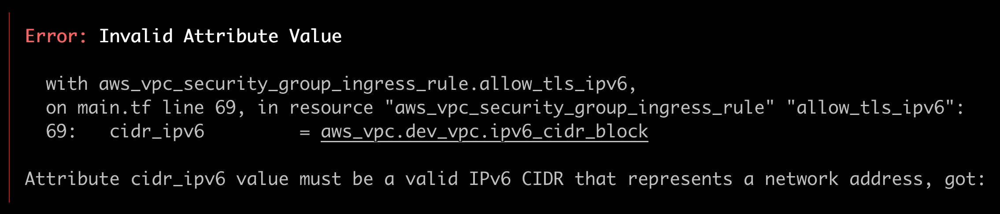

# Development Environment 

Building the infrastructure for a development environment on AWS


### Errors


```sh
resource "aws_vpc" "dev_vpc" {
    ...
    assign_generated_ipv6_cidr_block = true
}
```

### Generate and RSA ed25519 cryptographic key
```sh
ssh-keygen -t ed25519

# steps 
Generating public/private ed25519 key pair.
Enter file in which to save the key (/Users/sergio/.ssh/id_ed25519): /Users/sergio/.ssh/devenv_key
```


## Resources
- [AWS Provider](https://registry.terraform.io/providers/hashicorp/aws/latest/docs)
- [Shared Credentials Files](https://registry.terraform.io/providers/hashicorp/aws/latest/docs#shared_credentials_files)
- [AWS Route](https://registry.terraform.io/providers/hashicorp/aws/latest/docs/resources/route) - stand alone routes for an AWS Route Table
- [aws_ami data source](https://registry.terraform.io/providers/hashicorp/aws/latest/docs/data-sources/ami)
- [aws_key_pair resources](https://registry.terraform.io/providers/hashicorp/aws/latest/docs/resources/key_pair)
- [input variables](https://developer.hashicorp.com/terraform/language/values/variables)
- [variable definition precedence](https://developer.hashicorp.com/terraform/language/values/variables#variable-definition-precedence)


